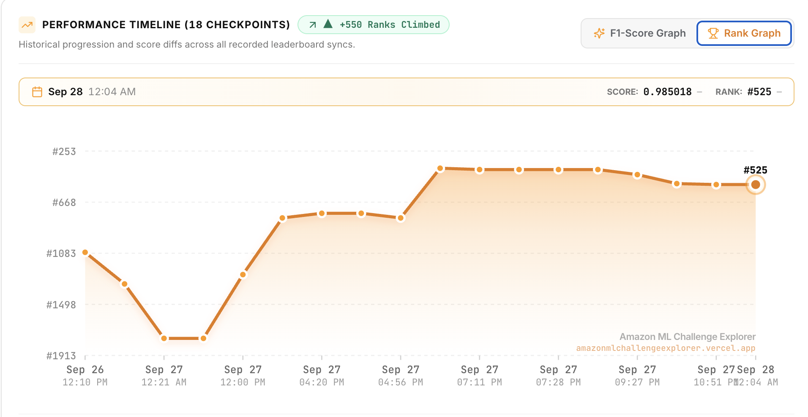

# Business Entity Resolution — Amazon ML Challenge 2026

> Retrieve → rank → resolve: a three-generation entity-resolution pipeline matching
> **1.7M business records against ~10M noisy candidates** with no subsampling.

| | |
|---|---|
| **Portal score** | **0.985018** · Rank **#525** (final submission, night of 27→28 Sep 2026) |
| **Held-out macro F0.5** | **0.9862** open world · **0.9886** closed world |
| **Scale** | 24,229,173 rows normalized · 202M candidate pairs retrieved |

**Contents:** [The task](#the-task) · [Approach](#the-approach-retrieve--rank--resolve) ·
[Scores](#the-score-generation-by-generation) · [Leaderboard climb](#leaderboard-climb) · [Repo layout](#repo-layout) ·
[Reproducing](#reproducing-it) · [Submission zip](#building-the-submission-zip) ·
[What would have closed the gap](#what-would-have-closed-the-gap) · [Team](#team)

We didn't win this one, but the pipeline got within striking distance of the best public
numbers for the challenge. The road there — three architecture generations in five days, a
24-million-row dataset, and a cluster-aware refine model built the night before the
deadline — is worth keeping around. This repo is that pipeline, reorganized after the
competition closed for anyone who wants to read or rerun it.

---

## The task

Given a deduplicated reference table **S1** (a business name, an address, a country), find
every record in two large, noisy pools **S2** and **S3** that describes the same business.
About 27% of S2/S3 records belong to no S1 entity at all — pure decoys — and every real
match is a strict one-to-one: no pool record is ever claimed by two S1 entities. Scored by
**macro-averaged F0.5 per S1 entity**, singletons included.

Scale: **24,229,173 rows** normalized once. The test split alone is 1,732,544 S1 entities
matched against 9,969,589 pool records — no subsampling anywhere, because a subsampled
negative pool reads a few points high and doesn't survive contact with the real leaderboard.

## The approach: retrieve → rank → resolve

```
 S1 × (S2 ∪ S3)        RETRIEVE              PRUNE               JUDGE               RESOLVE
  ~24M records     ┌───────────────┐   ┌───────────────┐   ┌─────────────────┐   ┌─────────────────┐
 ───────────────►  │ 5 sparse views│──►│ LightGBM keeps│──►│ XLM-R cross-    │──►│ per-S1 expected │
                   │ + fine-tuned  │   │ top 8 per     │   │ encoder judge   │   │ F0.5 pick, one  │
                   │ e5-small      │   │ S1/source,    │   │ (uncertain band)│   │ owner per       │
                   │ bi-encoder    │   │ sibling       │   │ + stacker       │   │ record, then a  │
                   │               │   │ expansion     │   │ + refine        │   │ cluster-aware   │
                   │               │   │               │   │                 │   │ refine pass     │
                   └───────────────┘   └───────────────┘   └─────────────────┘   └─────────────────┘
                     ~202M pairs         9.2M pairs          calibrated             final matches
                                         survive             probabilities
```

The last piece is the one that mattered most: a **cluster-aware refine model trained only
on entities no upstream model ever saw**. Every earlier stage — the fine-tuned encoder, the
cross-encoder judge, the stacker — is trained on the same split it's evaluated on, which
overstates confidence. The refine model instead trains on three *held-out* splits (850k
fresh entities, 3.9M pairs, S1-grouped cross-fitting) and scores every candidate against the
consensus of the entity's *other* confident copies — same name, same address, same house
number, same legal form — rather than in isolation.

Full write-up: [`docs/methodology.md`](docs/methodology.md) (the methodology document
submitted for judging) and [`docs/architecture.md`](docs/architecture.md) (the design
rationale it was built from).

## The score, generation by generation

| generation | what changed | held-out macro F0.5 |
|---|---|---|
| v1 | word/char TF-IDF retrieval, two-stage GBDT | ~0.90 (portal) |
| v2 | multi-view retrieval, isotonic calibration, Monte-Carlo expected-F0.5 selection | **0.9547** — kept at [`results/baseline_v2/`](results/baseline_v2/) |
| v3 (tabular) | five sparse retrieval views + LightGBM pruner/stacker | 0.9480 |
| v3 (neural) | + fine-tuned multilingual e5-small bi-encoder retrieval, XLM-R cross-encoder judge | **0.9776** — kept at [`results/neural_v3/`](results/neural_v3/) |
| v3 + refine | + cluster-aware refine model trained on held-out splits | 0.9822 |
| v3 + refine, full matrix | + full-S1-table name rarity, legal-form and IDF features | 0.9843 |
| **final** | + two extra clean splits, a second judge epoch, 3-seed bagging | **0.9862 / 0.9886** (open/closed) — **portal 0.985018**, kept at [`output/`](output/) |

The single biggest lever was retrieval: fine-tuning the bi-encoder on the competition's own
matches (InfoNCE with mined hard negatives) lifted pair recall from 93.2% to 99.6% and moved
the oracle ceiling from 0.974 to 0.999. Everything downstream of that — the judge, the
stacker, the refine model — was fighting over the remaining 1.3 points.

## Leaderboard climb

| | |
|---|---|
| **Final rank** | **#525** at score **0.985018** (Sep 28, 12:04 AM checkpoint) |
| **Net movement** | **+550 ranks** over 18 recorded leaderboard checkpoints |
| **Starting point** | ~#1,080 on the afternoon of 26 Sep |
| **Low point** | ~#1,900 shortly after midnight on 27 Sep |
| **Peak** | ~#290 during the evening of 27 Sep (roughly 5–9 PM) |

The trajectory had three phases: an early dip to about #1,900 in the first hours of 27 Sep,
a steep recovery through the day to around #600, and a jump into the top ~300 by the
evening. From there the rank drifted back to #525 by the final checkpoint even though our
score held steady, which is what a still-moving leaderboard looks like when other teams
land late improvements.



*Screenshot from the Amazon ML Challenge Explorer (amazonmlchallengeexplorer.vercel.app).*

## Repo layout

Repo root matches the exact `<team>_submission.zip` layout the organizers require (see
[`SUBMISSION.md`](SUBMISSION.md)), plus the supporting docs/history around it:

```
├── README.md                 — you are here
├── SUBMISSION.md             — how the official submission zip is built (now: just zip this repo)
├── Documentation_template.md — the filled-in methodology write-up, exact required filename
├── output/                   — the official deliverable: matching_results.tsv + candidate_pairs.tsv
├── code/business_entity_resolution/
│   ├── src/                  — the pipeline (same code as below, required path for judging)
│   ├── README.md             — reproduction instructions (copy of docs/runbook.md)
│   └── requirements.txt      — pinned dependencies
├── tools/                    — run scripts, build_submission.ps1, the official validator
├── notebooks/                — self-contained Kaggle notebook (no repo dependency)
├── docs/
│   ├── methodology.md        — the write-up submitted for judging
│   ├── architecture.md       — the design plan v3 was built from, with its error budget
│   ├── data-analysis.md      — measured facts about the data that drove every design choice
│   ├── runbook.md            — stage-by-stage instructions for running v3 end to end
│   ├── legacy-v1v2-pipeline.md — how to run the v1/v2 fallback
│   ├── problem_statement.pdf — the organizers' original problem statement
│   └── plans/                — earlier, superseded planning documents, kept for history
├── results/                  — two earlier milestone submissions (baseline_v2, neural_v3)
├── archive/final-day-run-log/ — the literal commands run in the last hours before the deadline
└── student_resource/         — organizer-provided dataset + validator (not tracked; see below)
```

`code/business_entity_resolution/src/` is the pipeline's one copy — nothing under `code/` is
duplicated elsewhere in the repo.

## Reproducing it

The dataset (`student_resource/`) is provided by the competition organizers and isn't
tracked in this repo. Drop it in at the repo root, then:

```bash
pip install -r requirements.txt          # tabular stages only
# neural stages additionally need torch + requirements-v3.txt — see docs/runbook.md
```

Then follow [`docs/runbook.md`](docs/runbook.md) for the current (v3) pipeline, stage by
stage, with the gates that decide what to do next. [`docs/legacy-v1v2-pipeline.md`](docs/legacy-v1v2-pipeline.md)
covers the lighter v1/v2 fallback, which needs no GPU and no fine-tuning.

Hardware used: 16 GB RAM, RTX 4060 laptop (8 GB VRAM), Python 3.14. Models:
`intfloat/multilingual-e5-small` and `FacebookAI/xlm-roberta-base`, both MIT-licensed and
fine-tuned only on the provided training data — no external data anywhere in the pipeline.

## Building the submission zip

One command assembles `submission\<team>_submission.zip` in the organizers' required layout
and runs the validator on it (details in [`SUBMISSION.md`](SUBMISSION.md)):

```powershell
.\tools\build_submission.ps1 -TeamName "YourTeam" -Members "Name One, Name Two"
```

## What would have closed the gap

Rank #525 with a 0.985 holdout-consistent score means the top of the leaderboard found
something structural this pipeline didn't. The honest gaps, in order of size:

- **France got zero-shot treatment.** It's 15% of the test set, entirely unlabeled, and
  region↔department address aliasing (`LILLE, Hauts-de-France` = `LILLE, Nord`) was only
  ever mined from pseudo-labelled clusters, never finished with a proper gazetteer pass.
- **No-address records were the single largest miss bucket** — 3.9% of true pairs but 63%
  of all misses before the refine layer's "borrow the group's address" feature, and even
  after it, only about half of no-address records are matched correctly.
- **No global assignment solver.** Matching is closer to optimal per-record greedy
  (each S2/S3 record keeps its single best S1) than a true one-to-many Hungarian-style
  assignment, which was judged unnecessary given a measured max cluster size of 11 — worth
  re-checking against whatever the winning teams did differently.

See [`docs/plans/03-final-day-plan.md`](docs/plans/03-final-day-plan.md) for the plan this
was measured against on the last day, and [`docs/methodology.md`](docs/methodology.md) §5
for the full error taxonomy.

---

## Team

Built by **Team Wizards** (Amrita Vishwa Vidyapeetham) for the Amazon ML Challenge 2026.

| Member | GitHub |
|---|---|
| Prajwal Priyadarshan | [@prajwal-priyadarshan](https://github.com/prajwal-priyadarshan) |
| Kesav Satya Sai Nimmagadda | [@kesavvvvvv](https://github.com/kesavvvvvv) |
| Kishore B | [@KishoreB25](https://github.com/KishoreB25) |
| Kabilan K | [@KKabilan07](https://github.com/KKabilan07) |
